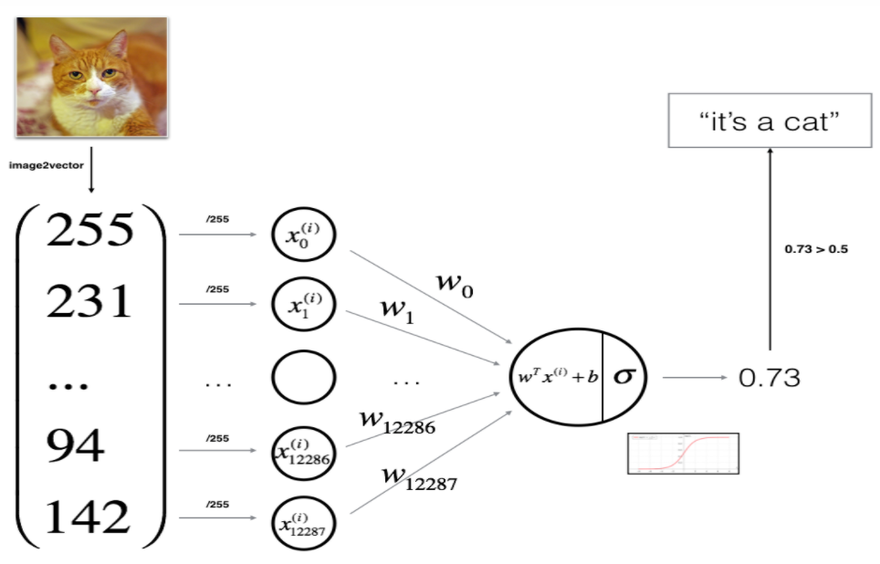
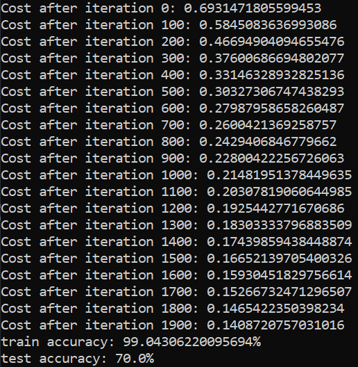
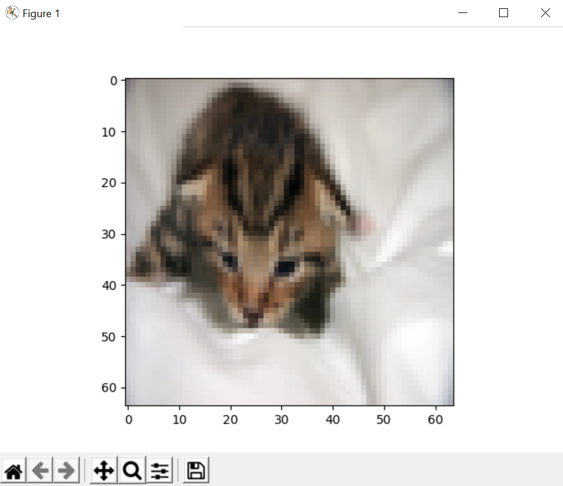

# Logistic Regression as a Neural Network
This repo implements a simple logistic regression classifier to recognize cats using Neural Network mindset.
  
The overall structure of this simple classifier:

## Result:
Accuracy and costs:  

  
Model tested on an image:  

